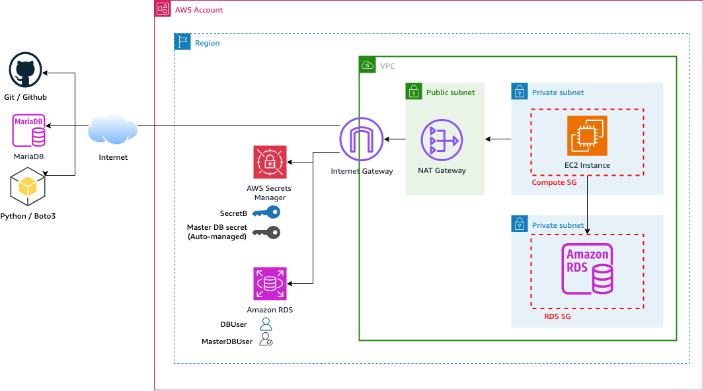
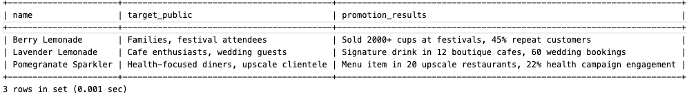

# re:Invent 2024 - SEC324 - ProTip #3 - Secrets consumption using Secrets Manager agent


This CloudFormation template sets up the necessary infrastructure prerequisites for an AWS environment with secure access patterns to demonstrate how AWS Secrets Manager agent can work.

## Overview

This template creates:
- A new VPC with public and private subnets
- Security Groups
- NAT Gateway and Internet Gateway for package downloads
- EC2 instance configured with AWS Systems Manager Session Manager access
- VPC Flow Logs with CloudWatch integration
- Required IAM roles and policies
- RDS instance with master credentials automatically managed by AWS Secrets Manager.



## Prerequisites

- An AWS account
- Appropriate permissions to create the resources defined in the template
- AWS CLI configured (if deploying via CLI)

## Parameters

The template accepts the following parameters:

- **ParamProjectName**: Project name identifier (Default: "reinv2024-sec324-protip3")
- **ParamVPCCidr**: CIDR block for the VPC (Default: 10.20.40.0/24)
- **ParamRssEC2SubnetACidr**: CIDR for Private Subnet A (Default: 10.20.40.0/26)
- **ParamSubnetBCidr**: CIDR for Private Subnet B (Default: 10.20.40.64/26)
- **ParamSubnetCCidr**: CIDR for Public Subnet C (Default: 10.20.40.128/26)
- **ParamLatestAmiId**: Latest Amazon Linux 2023 AMI ID (auto-retrieved from SSM Parameter Store)
- **ParamEC2InstanceType**: EC2 instance type (Default: t3.micro)
- **DBEngineVersion**: MySQL engine version (Default: "8.0.42")
- **DBPort**: Database port number (Default: 3306)
- **ParamDBName**: Database name (Default: 'Campaign')
- **DBInstanceClass**: Database instance type (Default: 'db.t3.micro')
- **DBUsername**: Username for MySQL database access (Default: 'DBAdminUser')
- **DBUser**: Database username for app (Default: 'Bob')

## Resources Created

1. **VPC Infrastructure**
   - VPC with DNS support enabled
   - 2 Private Subnets (A and B)
   - 1 Public Subnet (C) that hosts a NAT Gateway
   - Internet Gateway
   - NAT Gateway with Elastic IP
   - Route tables for public and private subnets
   - VPC Flow Logs

2. **Security**
   - IAM roles for EC2 and Systems Manager integration
   - Security Groups
   - VPC Flow Logs with CloudWatch integration

3. **Compute**
   - Launch Template for EC2 instances
   - EC2 instance with Systems Manager Session Manager access
   - Instance Profile with necessary permissions

4. **🍹 Database**
   - RDS MySQL instance in private subnet
   - RDS master credentials managed by AWS Secrets Manager
   - DBUser secret for application access
   - DB Subnet Group spanning multiple AZs
   - Automatic database setup with sample mocktail data
      - Heathy ingredients: 🍋 🥥 🍓 🍊 🧊
      - Recipes: 🍸 🥤
      - Promotion results: 💹 📊
      - Target Audience : 🎯


5. **Secrets Management**
   - DBUser secret with generated credentials.

## Security Features

- Systems Manager Session Manager for secure instance access (no SSH required)
- VPC Flow Logs for network traffic monitoring
- Managed IAM policies with least privilege access
- Secure secrets management integration

## Testing
Please follow the [official documentation](https://docs.aws.amazon.com/secretsmanager/latest/userguide/secrets-manager-agent.html) and this [blog post](https://aws.amazon.com/blogs/security/how-to-use-the-aws-secrets-manager-agent/) to install AWS Secrets Manager agent.

### Verify Database Deployment
To confirm the database has been successfully deployed and configured, check the database setup log file on the EC2 instance:

```bash
cat /var/log/db_setup.log
```

This log file contains the complete database initialization process, including table creation, data insertion, and user setup verification. Look for **"Database setup completed successfully"** to confirm successful deployment.

### Agent installation
Connect to your private EC2 instance using Session Manager.
Once connected, you can run the command below in your EC2 instance to download, build, install the agent and configure the permission on the access token.

   ```bash
      date
      cd ~;git clone https://github.com/aws/aws-secretsmanager-agent
      sudo yum -y groupinstall "Development Tools"
      date
      curl --proto '=https' --tlsv1.2 -sSf https://sh.rustup.rs | sh -s -- -y
      . "$HOME/.cargo/env"
      cd aws-secretsmanager-agent
      pwd;date;
      cargo build --release
      cd aws_secretsmanager_agent/configuration
      sudo ./install
      pwd;date
      sudo cp /var/run/awssmatoken /tmp
      sudo chown ssm-user /tmp/awssmatoken
      whoami
      pwd
      date
   ```

### Use the agent to fetch the DB credentials
Human are kept away from secrets; therefore programatically use the agent to obtain the secret value to connect to the DB. Please find the name of secret created for the DB instance deployed.

   ```bash
   echo 'Fetch the DB managed credentials in AWS Secrets Manager'
   region='<YOUR-REGION>'
   aws secretsmanager list-secrets --query 'reverse(sort_by(SecretList[?DeletedDate==null], &CreatedDate))[*].[Name,ARN,CreatedDate]' --output table --region $region
   secret='<DB_USER_SECRET_NAME_ARN>'
   echo 'The secret ARN is: '$secret
   curl -H "X-Aws-Parameters-Secrets-Token: $(</tmp/awssmatoken)" localhost:2773/secretsmanager/get?secretId=$secret | jq -r .ARN
   username=`curl -H "X-Aws-Parameters-Secrets-Token: $(</tmp/awssmatoken)" localhost:2773/secretsmanager/get?secretId=$secret | jq -r .SecretString | jq -r .username`
   password=`curl -H "X-Aws-Parameters-Secrets-Token: $(</tmp/awssmatoken)" localhost:2773/secretsmanager/get?secretId=$secret | jq -r .SecretString | jq -r .password`
   echo 'The DB username is :'$username
   ```
### Connect to the DB created using the credentials stored in AWS Secrets Manager
#### Get the database endpoint name
Get the database full endpoint name, like `DATABASE_NAME.ABCD124563ED.REGION.rds.amazonaws.com` created with this template, and set its value below. To get DB endpoint full name, you can:
1. Find it in the CloudFormation Outputs by copying the **Value** associated with the key `DatabaseEndpoint`
2. Run the command below to find the DB endpoint
```
aws rds describe-db-instances --query 'DBInstances[].[DBInstanceIdentifier,Endpoint.Address,Endpoint.Port]' --output table --region $region
```

3. Use the console to find your DB instance endpoint full name.

#### Connect to the MySQL database
To connect to the databse, you need:
- the `$username` and `$password` defined previously
- the value of `ParamDBName`. This is the value you set in the parameter and you can find it in the output. The default value is `Campaign`.

Replace the parameters below with the right values and run those commands:

   ```
   dbendpoint='DATABASE_NAME.ABCD124563ED.REGION.rds.amazonaws.com'
   DBName='ParamDBName'
   echo 'Now connect to the database without seeing the secret value...'
   mysql -h $dbendpoint -P 3306 -u $username -p$password -D $DBName

   ```

### Query the Database to find the top three most successful campaign
```SQL
SELECT name, target_public, promotion_results
FROM Mocktail 
ORDER BY promotion_results DESC 
LIMIT 3;
```

The results should look at below:

MySQL [Campaign]> SELECT name, target_public, promotion_results
    -> FROM Mocktail
    -> ORDER BY promotion_results DESC
    -> LIMIT 3;



## Notes

- **Humans are kept away from secrets** - Applications use AWS Secrets Manager agent to retrieve credentials
- The private EC2 instance is accessible via AWS Systems Manager Session Manager only
- Database credentials should be managed securely through AWS Secrets Manager.


## EC2 Instance Configuration

The EC2 instance comes pre-configured with:
- AWS Systems Manager Agent
- MariaDB 10.5 client
- Git
- AWS CloudFormation bootstrap tools
- JSON processing capabilities (`jq`)
- Python 3.12 and pip
- PyMySQL and Boto3 libraries
- Automated database setup script

## Best Practices Implemented

- Use the Secrets Manager agent instead of direct API call
- Keep humans away from secrets
- Private hosting of sensitive resources
- Use AWS Systems Manager Session Manager instead of opening SSH port over internet
- VPC Flow Logs for network monitoring
- Proper subnet segregation (public/private).

## Deployment

The template can be deployed through:
- AWS Management Console
- AWS CLI
- AWS CloudFormation API


*Originally created for re:Invent 2024 - SEC324 - Code Talk & updated for the AWS Los Angeles Summit Sept 2025* 

 🍹 Cheers! (with mocktails)!