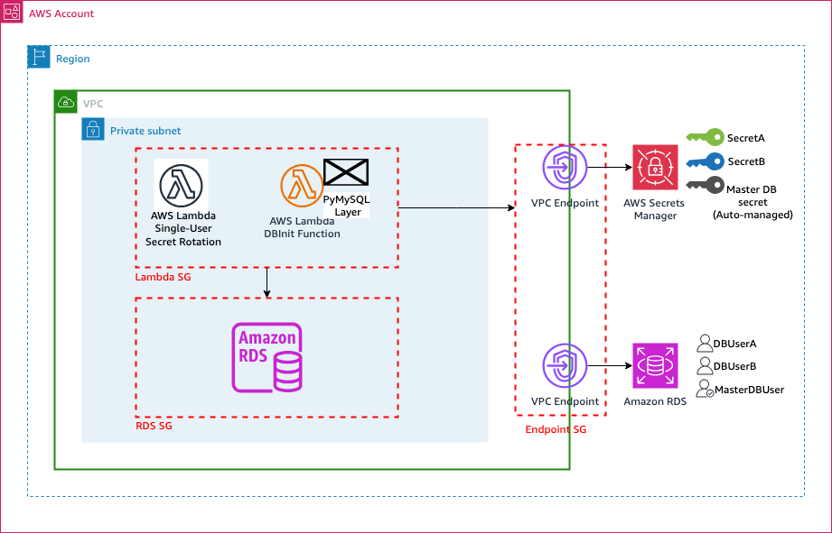

# re:Invent 2024 - SEC324 - Pro Tip #4: Secrets Lifecycle


## Overview

This CloudFormation template sets up a network architecture with private subnets, VPC endpoints, and secure database access patterns using AWS Secrets Manager.

Secrets are created by AWS Secrets Manager with randomly generated password. Secrets are used to configure the database users. A Lambda function populate the database.

Secrets rotation is configured for the DB users (not the Master DB user which is automatically managed by Secrets Manager). A Lambda function for rotation is created to perform the secrets rotation.

## Important

### Prerequisite: Lambda Layer for MySQL Connectivity

Before deploying this template, you must create a Lambda Layer containing the PyMySQL library.
#### Reuse the Lambda layer
A Lambda Layer is propose with this template. You can use AWS console [to create the Lambda layer](https://docs.aws.amazon.com/lambda/latest/dg/creating-deleting-layers.html#layers-create.
- The file is name is : `PyMySQL-Layer-6ac2d76c-16aa-48b1-b1c5-1a63450eef49.zip`.
- SHA256 (PyMySQL-Layer-6ac2d76c-16aa-48b1-b1c5-1a63450eef49.zip) = `13b4b7745a71b54e23d6623d0ddda0657dbb4ea9d4a90fd9e1ed9e8877ba6806`.

#### Create your own Lambda layer

1. **Create the Layer:**
   ```bash
   mkdir python
   pip install pymysql -t python/
   zip -r pymysql-layer.zip python/

2. **Upload the layer to AWS Lambda:**
You can use AWS console [to create the Lambda layer](https://docs.aws.amazon.com/lambda/latest/dg/creating-deleting-layers.html#layers-create) or use AWS CLI to run the command below:
   ```
   aws lambda publish-layer-version \
   --layer-name PyMySQL-Layer \
   --description "PyMySQL library for Lambda" \
   --zip-file fileb://pymysql-layer.zip \
   --compatible-runtimes python3.12
   ```
3. **Update Parameter:**
Note the layer version number from the output

Update `ParamLambdaLayerMySQL` parameter to `PyMySQL-Layer:X` (where X is the version).


### Post-Deployment : Manual Database Initialization
**After** stack deployment, manually execute the Lambda function to initialize the database:

1. Navigate to Lambda Console in the region where the stack is deployed
2. Find the function: `{StackName}-DBInitFunction-{RandomString}`
3. Create test event
4. Verify success by reading the Lambda execution logs.


## Architecture Components


### VPC Configuration
- Custom VPC with DNS support
- Two private subnets across different AZs
- Secure network isolation
- CIDR: 10.20.30.40/24

### VPC Endpoints
- RDS VPC Endpoint
- Secrets Manager VPC Endpoint
- Private DNS enabled
- Interface endpoint type

### Security Groups
#### 1. **RDS Security Group
   - Inbound access from Lambda only
   - Restricted outbound to loopback
   - Port 3306 (MySQL)

#### 2. Lambda Security Group
   - Outbound to RDS
   - Outbound to VPC endpoints
   - Restricted to necessary ports

#### 3. Endpoint Security Group
   - HTTPS (443) access
   - Restricted outbound to loopback

#### 4. Self-Reference Ingress Rule
The RDS Security Group includes a special self-reference ingress rule that allows resources within the same security group to communicate with each other.
**Purpose:**
 - Enables the Secrets Manager rotation Lambda function to connect to RDS
 - The rotation Lambda (created automatically) is placed in the same security group as RDS
 - Required for automated password rotation functionality.

**Why This is Needed:**
When Secrets Manager creates the hosted rotation Lambda function, it automatically assigns the same security group as the RDS instance. The self-reference rule ensures the rotation function can establish database connections to perform password updates during the rotation process.

## Database Configuration

### RDS Instance
- MySQL Engine 8.0.42
- Private subnet placement
- Encrypted storage
- IAM database authentication
- Managed master user by AWS Secrets Manager 

### Database Initialization
- Lambda function creates a MySQL Database
- Lambda creates two DB users with passwords created and stored in Secrets Manager
- Test the successful creation of a DB User and connect to the DB with that DB User

### Secrets Management
- Automated password generation
- Secure storage in AWS Secrets Manager
- Multiple user secrets (DBUserA, DBUserB)
- KMS encryption

### Secrets Rotation
- Automated rotation schedule (every 4 days)
- MySQL single-user rotation
- Hosted rotation Lambda function
- Secret target attachments to RDS

## Parameters

| Parameter | Default | Description |
|-----------|---------|-------------|
| VpcCIDR | 10.20.30.40/24 | VPC CIDR block |
| SubnetACIDR | 10.20.30.40/26 | Private Subnet A |
| SubnetBCIDR | 10.20.30.64/26 | Private Subnet B |
| DBName | Campaign | Database name |
| DBUsername | MasterDBUser | Master database username |
| DBInstanceClass | db.t3.micro | Database instance type |
| DBPort | 3306 | Database port |
| ParamLambdaLayerMySQL | PyMySQL-Layer:1 | Lambda layer for MySQL |


## Security Features

### Network Security
- Private subnets only
- No Internet Gateway
- VPC Endpoints for AWS services
- Restricted security group rules

### Access Control
- IAM authentication
- Secrets Manager integration
- Least privilege permissions
- Security group isolation

### Encryption
- Storage encryption enabled
- In-transit encryption
- KMS key management
- Secure secret storage

## Lambda Integration

### Lambda Function
- VPC-enabled
- Private subnet placement
- Secure database access
- PyMySQL Layer support

### IAM Role
- VPC execution permissions
- Secrets Manager access
- Minimal required permissions
- Secure secret retrieval

## Best Practices Implemented

1. **Network Isolation**
   - Private subnets
   - No public access
   - Endpoint-based connectivity

2. **Security Controls**
   - Encrypted storage
   - IAM authentication
   - Secure secrets handling
   - Least privilege access


## Important Considerations

- All resources are deployed in private subnets
- Database is not publicly accessible
- Secrets are managed through AWS Secrets Manager
- Security groups follow least privilege principle
- VPC Endpoints instead of NAT Gateway generates savings.

---

*Created for re:Invent 2024 SEC324 Code Talk*
